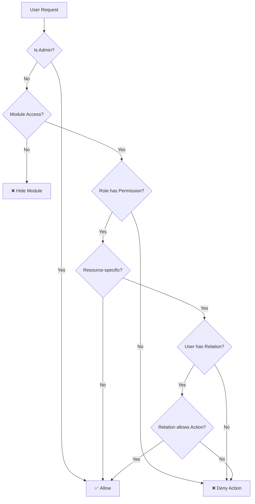

# Permission Matrix & Authorization Rules
> **Mục tiêu**: Định nghĩa chi tiết quyền truy cập theo Module, Role, và Resource
> **Language**: Vietnamese (Tiếng Việt)

---

## 1. Tổng quan Hệ thống Phân quyền

### 1.1 Mô hình Phân quyền 3 Lớp
```
┌─────────────────────────────────────────────────────────────────┐
│  LAYER 1: Module Access (Visibility)                            │
│  ─────────────────────────────────────                          │
│  Role nào được THẤY module nào?                                 │
│  VD: Nhân viên kỹ thuật KHÔNG thấy Finance, HR                  │
└─────────────────────────────────────────────────────────────────┘
                              ↓
┌─────────────────────────────────────────────────────────────────┐
│  LAYER 2: Role-Based Access Control (RBAC)                      │
│  ─────────────────────────────────────────                      │
│  Role nào có quyền gì trong module?                             │
│  VD: Manager có quyền Approve, Staff chỉ Create                 │
└─────────────────────────────────────────────────────────────────┘
                              ↓
┌─────────────────────────────────────────────────────────────────┐
│  LAYER 3: Resource-Based Access Control (ReBAC)                 │
│  ──────────────────────────────────────────────                 │
│  User có quyền gì trên resource CỤ THỂ?                         │
│  VD: PM dự án A có quyền edit dự án A, không edit dự án B       │
└─────────────────────────────────────────────────────────────────┘
```

---

## 2. System Roles (Vai trò Hệ thống)

### 2.1 Role Definitions
| Role ID | Role Name (VN) | Role Name (EN) | Description |
| :--- | :--- | :--- | :--- |
| `super_admin` | Quản trị viên cao cấp | Super Admin | Full access, manage tenants |
| `admin` | Quản trị viên | Admin | Full access within tenant |
| `manager` | Quản lý | Manager | Department/Module manager |
| `accountant` | Kế toán | Accountant | Finance access |
| `hr_staff` | Nhân sự | HR Staff | HR access |
| `pm` | Quản lý dự án | Project Manager | Project management |
| `engineer` | Kỹ sư | Engineer | Technical work |
| `technician` | Nhân viên kỹ thuật | Technician | Field work |
| `sales` | Nhân viên kinh doanh | Sales Staff | Sales module |
| `warehouse` | Thủ kho | Warehouse Staff | Inventory access |
| `viewer` | Người xem | Viewer | Read-only access |

### 2.2 Role Hierarchy
```
super_admin
    └── admin
            ├── manager
            │       ├── pm (Projects, Manufacturing)
            │       ├── accountant (Finance)
            │       ├── hr_staff (HR)
            │       └── sales (Sales, CRM)
            │
            └── staff
                    ├── engineer
                    ├── technician
                    ├── warehouse
                    └── viewer
```

---

## 3. Module Access Matrix (Layer 1)

### 3.1 Ai được thấy Module nào?

| Module | super_admin | admin | manager | pm | accountant | hr_staff | sales | engineer | technician | warehouse | viewer |
| :--- | :---: | :---: | :---: | :---: | :---: | :---: | :---: | :---: | :---: | :---: | :---: |
| **Dashboard** | ✅ | ✅ | ✅ | ✅ | ✅ | ✅ | ✅ | ✅ | ✅ | ✅ | ✅ |
| **Sales/CPQ** | ✅ | ✅ | ✅ | ⬜ | ⬜ | ⬜ | ✅ | ⬜ | ⬜ | ⬜ | ⬜ |
| **Inventory** | ✅ | ✅ | ✅ | ✅ | ⬜ | ⬜ | ⬜ | ✅ | ✅ | ✅ | ⬜ |
| **Manufacturing** | ✅ | ✅ | ✅ | ✅ | ⬜ | ⬜ | ⬜ | ✅ | ✅ | ⬜ | ⬜ |
| **Projects** | ✅ | ✅ | ✅ | ✅ | ⬜ | ⬜ | ⬜ | ✅ | ✅ | ⬜ | ⬜ |
| **Finance** | ✅ | ✅ | ✅ | ⬜ | ✅ | ⬜ | ⬜ | ⬜ | ⬜ | ⬜ | ⬜ |
| **HR** | ✅ | ✅ | ✅ | ⬜ | ⬜ | ✅ | ⬜ | ⬜ | ⬜ | ⬜ | ⬜ |
| **CRM/Customer** | ✅ | ✅ | ✅ | ⬜ | ⬜ | ⬜ | ✅ | ⬜ | ⬜ | ⬜ | ⬜ |
| **Settings** | ✅ | ✅ | ⬜ | ⬜ | ⬜ | ⬜ | ⬜ | ⬜ | ⬜ | ⬜ | ⬜ |
| **Reports** | ✅ | ✅ | ✅ | ✅ | ✅ | ✅ | ✅ | ⬜ | ⬜ | ⬜ | ⬜ |

> **Legend**: ✅ = Có quyền truy cập | ⬜ = Không thấy module

### 3.2 Implementation
```go
// Module visibility configuration
var ModuleAccess = map[string][]string{
    "dashboard":     {"*"},  // All roles
    "sales":         {"super_admin", "admin", "manager", "sales"},
    "inventory":     {"super_admin", "admin", "manager", "pm", "engineer", "technician", "warehouse"},
    "manufacturing": {"super_admin", "admin", "manager", "pm", "engineer", "technician"},
    "projects":      {"super_admin", "admin", "manager", "pm", "engineer", "technician"},
    "finance":       {"super_admin", "admin", "manager", "accountant"},
    "hr":            {"super_admin", "admin", "manager", "hr_staff"},
    "crm":           {"super_admin", "admin", "manager", "sales"},
    "settings":      {"super_admin", "admin"},
    "reports":       {"super_admin", "admin", "manager", "pm", "accountant", "hr_staff", "sales"},
}

func (s *PermissionService) CanAccessModule(ctx context.Context, userRole, module string) bool {
    allowedRoles, exists := ModuleAccess[module]
    if !exists {
        return false
    }
    
    for _, role := range allowedRoles {
        if role == "*" || role == userRole {
            return true
        }
    }
    return false
}
```

---

## 4. RBAC per Module (Layer 2)

### 4.1 Projects Module

| Action | admin | manager | pm | engineer | technician | viewer |
| :--- | :---: | :---: | :---: | :---: | :---: | :---: |
| **Project - View All** | ✅ | ✅ | ⬜ | ⬜ | ⬜ | ⬜ |
| **Project - View Own** | ✅ | ✅ | ✅ | ✅ | ✅ | ✅ |
| **Project - Create** | ✅ | ✅ | ⬜ | ⬜ | ⬜ | ⬜ |
| **Project - Edit** | ✅ | ✅ | ✅* | ⬜ | ⬜ | ⬜ |
| **Project - Delete** | ✅ | ⬜ | ⬜ | ⬜ | ⬜ | ⬜ |
| **Project - Assign Members** | ✅ | ✅ | ✅* | ⬜ | ⬜ | ⬜ |
| **Task - View All** | ✅ | ✅ | ✅* | ⬜ | ⬜ | ⬜ |
| **Task - View Assigned** | ✅ | ✅ | ✅ | ✅ | ✅ | ✅ |
| **Task - Create** | ✅ | ✅ | ✅* | ⬜ | ⬜ | ⬜ |
| **Task - Edit Own** | ✅ | ✅ | ✅ | ✅ | ✅ | ⬜ |
| **Task - Edit Any** | ✅ | ✅ | ✅* | ⬜ | ⬜ | ⬜ |
| **Task - Update Progress** | ✅ | ✅ | ✅ | ✅ | ✅ | ⬜ |
| **Budget - View** | ✅ | ✅ | ✅* | ⬜ | ⬜ | ⬜ |
| **Budget - Edit** | ✅ | ✅ | ⬜ | ⬜ | ⬜ | ⬜ |

> **Note**: ✅* = Chỉ áp dụng cho dự án mà user là PM (ReBAC)

### 4.2 Finance Module

| Action | admin | manager | accountant |
| :--- | :---: | :---: | :---: |
| **COA - View** | ✅ | ✅ | ✅ |
| **COA - Create/Edit** | ✅ | ⬜ | ✅ |
| **Journal - View** | ✅ | ✅ | ✅ |
| **Journal - Create** | ✅ | ⬜ | ✅ |
| **Journal - Post** | ✅ | ⬜ | ✅ |
| **Journal - Reverse** | ✅ | ⬜ | ⬜ |
| **AP/AR - View** | ✅ | ✅ | ✅ |
| **AP/AR - Create** | ✅ | ⬜ | ✅ |
| **AP/AR - Approve** | ✅ | ✅ | ⬜ |
| **Reports - View** | ✅ | ✅ | ✅ |
| **Reports - Export** | ✅ | ✅ | ✅ |
| **Period - Close** | ✅ | ⬜ | ⬜ |

### 4.3 HR Module

| Action | admin | manager | hr_staff |
| :--- | :---: | :---: | :---: |
| **Employee - View All** | ✅ | ✅ | ✅ |
| **Employee - View Salary** | ✅ | ⬜ | ✅ |
| **Employee - Create/Edit** | ✅ | ⬜ | ✅ |
| **Attendance - View** | ✅ | ✅ | ✅ |
| **Attendance - Edit** | ✅ | ⬜ | ✅ |
| **Payroll - View** | ✅ | ⬜ | ✅ |
| **Payroll - Process** | ✅ | ⬜ | ✅ |
| **Payroll - Approve** | ✅ | ✅ | ⬜ |
| **Reports - View** | ✅ | ✅ | ✅ |

### 4.4 Inventory Module

| Action | admin | manager | engineer | technician | warehouse |
| :--- | :---: | :---: | :---: | :---: | :---: |
| **Item - View** | ✅ | ✅ | ✅ | ✅ | ✅ |
| **Item - Create/Edit** | ✅ | ✅ | ⬜ | ⬜ | ✅ |
| **Item - Delete** | ✅ | ⬜ | ⬜ | ⬜ | ⬜ |
| **Stock - View** | ✅ | ✅ | ✅ | ✅ | ✅ |
| **Stock In - Create** | ✅ | ✅ | ⬜ | ⬜ | ✅ |
| **Stock Out - Create** | ✅ | ✅ | ✅ | ⬜ | ✅ |
| **Stock Out - Request** | ✅ | ✅ | ✅ | ✅ | ✅ |
| **Adjustment - Create** | ✅ | ✅ | ⬜ | ⬜ | ✅ |
| **Adjustment - Approve** | ✅ | ✅ | ⬜ | ⬜ | ⬜ |

### 4.5 Sales Module

| Action | admin | manager | sales | viewer |
| :--- | :---: | :---: | :---: | :---: |
| **Quote - View All** | ✅ | ✅ | ⬜ | ⬜ |
| **Quote - View Own** | ✅ | ✅ | ✅ | ✅ |
| **Quote - Create** | ✅ | ✅ | ✅ | ⬜ |
| **Quote - Edit Draft** | ✅ | ✅ | ✅ | ⬜ |
| **Quote - Submit** | ✅ | ✅ | ✅ | ⬜ |
| **Quote - Approve (≤5%)** | ✅ | ✅ | ✅ | ⬜ |
| **Quote - Approve (≤10%)** | ✅ | ✅ | ⬜ | ⬜ |
| **Quote - Approve (>10%)** | ✅ | ⬜ | ⬜ | ⬜ |
| **Order - Create** | ✅ | ✅ | ✅ | ⬜ |
| **Order - Cancel** | ✅ | ✅ | ⬜ | ⬜ |

### 4.6 Customer/CRM Module

| Action | admin | manager | sales |
| :--- | :---: | :---: | :---: |
| **Account - View All** | ✅ | ✅ | ⬜ |
| **Account - View Own** | ✅ | ✅ | ✅ |
| **Account - Create** | ✅ | ✅ | ✅ |
| **Account - Edit Any** | ✅ | ✅ | ⬜ |
| **Account - Edit Own** | ✅ | ✅ | ✅ |
| **Account - Transfer** | ✅ | ✅ | ⬜ |
| **Contact - CRUD** | ✅ | ✅ | ✅* |

> **Note**: ✅* = Sales can only manage contacts in accounts they own

### 4.7 Manufacturing Module

| Action | admin | manager | pm | engineer | technician |
| :--- | :---: | :---: | :---: | :---: | :---: |
| **Work Order - View All** | ✅ | ✅ | ✅ | ⬜ | ⬜ |
| **Work Order - View Assigned** | ✅ | ✅ | ✅ | ✅ | ✅ |
| **Work Order - Create** | ✅ | ✅ | ✅ | ⬜ | ⬜ |
| **Work Order - Edit** | ✅ | ✅ | ✅* | ⬜ | ⬜ |
| **Work Order - Assign** | ✅ | ✅ | ✅* | ⬜ | ⬜ |
| **Work Order - Start** | ✅ | ✅ | ✅ | ✅ | ✅ |
| **Work Order - Complete** | ✅ | ✅ | ✅ | ✅ | ⬜ |
| **Work Order - Close** | ✅ | ✅ | ⬜ | ⬜ | ⬜ |
| **HSE Safety - Gatekeep** | ✅ | ✅ | ⬜ | ⬜ | ⬜ |

> **Note**: ✅* = PM can only manage work orders in their projects

---

## 5. Resource-Based Access (Layer 3 - ReBAC)

### 5.1 Project Resource Permissions

**Relations**:
| Relation | Description | Permissions |
| :--- | :--- | :--- |
| `owner` | Người tạo dự án | Full access (edit, delete, manage members) |
| `manager` | Quản lý dự án (PM) | Edit project, manage tasks, view budget |
| `member` | Thành viên dự án | View project, edit assigned tasks |
| `viewer` | Người xem | View only |

**Data Model**:
```sql
CREATE TABLE project_members (
    id UUID PRIMARY KEY DEFAULT gen_random_uuid(),
    tenant_id UUID NOT NULL REFERENCES tenants(id),
    project_id UUID NOT NULL REFERENCES projects(id),
    user_id UUID NOT NULL REFERENCES users(id),
    relation TEXT NOT NULL,  -- 'owner', 'manager', 'member', 'viewer'
    created_at TIMESTAMP DEFAULT NOW(),
    created_by UUID REFERENCES users(id),
    UNIQUE(project_id, user_id)
);

ALTER TABLE project_members ENABLE ROW LEVEL SECURITY;
CREATE POLICY tenant_isolation ON project_members
    USING (tenant_id = current_setting('app.current_tenant')::uuid);
```

### 5.2 Permission Check Logic
```go
// Check if user can perform action on project
func (s *PermissionService) CanOnProject(
    ctx context.Context, 
    userID, projectID, action string,
) bool {
    // 1. Check if user is admin/manager (bypass)
    userRole := ctx.Value("user_role").(string)
    if userRole == "admin" || userRole == "manager" {
        return true
    }
    
    // 2. Get user's relation to this project
    var relation string
    err := s.db.QueryRowContext(ctx, `
        SELECT relation FROM project_members
        WHERE project_id = $1 AND user_id = $2
    `, projectID, userID).Scan(&relation)
    
    if err != nil {
        return false  // Not a member
    }
    
    // 3. Check if relation allows action
    return s.relationAllowsAction(relation, action)
}

func (s *PermissionService) relationAllowsAction(relation, action string) bool {
    permissions := map[string][]string{
        "owner":   {"view", "edit", "delete", "manage_members", "view_budget", "edit_budget"},
        "manager": {"view", "edit", "manage_members", "view_budget", "create_task", "edit_any_task"},
        "member":  {"view", "edit_own_task", "update_progress"},
        "viewer":  {"view"},
    }
    
    allowed, exists := permissions[relation]
    if !exists {
        return false
    }
    
    for _, perm := range allowed {
        if perm == action {
            return true
        }
    }
    return false
}
```

### 5.3 Task-Level Permissions
```go
// Check if user can edit a specific task
func (s *PermissionService) CanEditTask(
    ctx context.Context,
    userID, taskID string,
) bool {
    // Get task and project info
    var projectID, assigneeID string
    err := s.db.QueryRowContext(ctx, `
        SELECT project_id, assignee_id FROM tasks WHERE id = $1
    `, taskID).Scan(&projectID, &assigneeID)
    
    if err != nil {
        return false
    }
    
    // Owner/Manager can edit any task in project
    if s.CanOnProject(ctx, userID, projectID, "edit_any_task") {
        return true
    }
    
    // Member can only edit if they are assignee
    if assigneeID == userID {
        return s.CanOnProject(ctx, userID, projectID, "edit_own_task")
    }
    
    return false
}
```

---

## 6. UI Permission Enforcement

### 6.1 Frontend Permission Hook
```typescript
// hooks/usePermission.ts
import { useAuth } from './useAuth';

interface PermissionCheck {
  module?: string;
  action?: string;
  resource?: { type: string; id: string };
}

export function usePermission() {
  const { user } = useAuth();

  const can = async (check: PermissionCheck): Promise<boolean> => {
    // 1. Module access check
    if (check.module) {
      const moduleAccess = await api.get(`/permissions/module/${check.module}`);
      if (!moduleAccess.data.allowed) return false;
    }

    // 2. Action check
    if (check.action && check.resource) {
      const response = await api.post('/permissions/check', {
        action: check.action,
        resource_type: check.resource.type,
        resource_id: check.resource.id,
      });
      return response.data.allowed;
    }

    return true;
  };

  const canSync = (check: PermissionCheck): boolean => {
    // Synchronous check based on cached permissions
    if (check.module && user) {
      return ModuleAccess[check.module]?.includes(user.role) ?? false;
    }
    return false;
  };

  return { can, canSync, role: user?.role };
}
```

### 6.2 Conditional UI Rendering
```typescript
// Example: Project Edit Button
function ProjectActions({ project }) {
  const { can } = usePermission();
  const [canEdit, setCanEdit] = useState(false);

  useEffect(() => {
    can({ 
      action: 'edit', 
      resource: { type: 'project', id: project.id } 
    }).then(setCanEdit);
  }, [project.id]);

  return (
    <div>
      {canEdit && (
        <Button onClick={() => openEditModal(project)}>
          Chỉnh sửa
        </Button>
      )}
      {/* Everyone can view */}
      <Button onClick={() => openViewModal(project)}>
        Xem chi tiết
      </Button>
    </div>
  );
}
```

### 6.3 Route Protection
```typescript
// app/finance/layout.tsx
import { redirect } from 'next/navigation';
import { getCurrentUser } from '@/lib/auth';

export default async function FinanceLayout({ children }) {
  const user = await getCurrentUser();
  
  // Finance module - only for admin, manager, accountant
  const allowedRoles = ['super_admin', 'admin', 'manager', 'accountant'];
  
  if (!allowedRoles.includes(user?.role)) {
    redirect('/dashboard?error=unauthorized');
  }

  return <>{children}</>;
}
```

---

## 7. Data Model Summary

### 7.1 Permission Tables
```sql
-- User roles (system roles)
ALTER TABLE users ADD COLUMN role TEXT DEFAULT 'viewer';

-- Project membership with relations
CREATE TABLE project_members (
    id UUID PRIMARY KEY,
    tenant_id UUID NOT NULL,
    project_id UUID NOT NULL,
    user_id UUID NOT NULL,
    relation TEXT NOT NULL,  -- 'owner', 'manager', 'member', 'viewer'
    created_at TIMESTAMP DEFAULT NOW()
);

-- Generic permissions table (for future resources)
CREATE TABLE permissions (
    id UUID PRIMARY KEY,
    tenant_id UUID NOT NULL,
    subject_id UUID NOT NULL,      -- User or Role
    subject_type TEXT NOT NULL,    -- 'user', 'role'
    relation TEXT NOT NULL,        -- 'owner', 'editor', 'viewer'
    object_id UUID NOT NULL,       -- Resource ID
    object_type TEXT NOT NULL,     -- 'project', 'document', 'report'
    created_at TIMESTAMP DEFAULT NOW()
);
```

---

## 8. Quick Reference

### 8.1 Permission Check Flowchart


### 8.2 Common Scenarios

| Scenario | Check |
| :--- | :--- |
| Technician truy cập Finance | ❌ Module Access denied |
| PM edit dự án của mình | ✅ ReBAC: relation = manager |
| PM edit dự án khác | ❌ ReBAC: no relation |
| Member edit task được gán | ✅ ReBAC: is assignee |
| Member edit task của người khác | ❌ ReBAC: not assignee |
| Viewer xem dự án | ✅ ReBAC: relation = viewer |
| Viewer edit dự án | ❌ ReBAC: viewer cannot edit |

---

## 9. Security Rules (Advanced)

### 9.1 Segregation of Duties
> **Rule**: Creator CANNOT be Approver for the same item

| Resource Type | Enforce |
| :--- | :---: |
| Purchase Orders | ✅ |
| Quotes (>5% discount) | ✅ |
| Journal Entries | ✅ |
| Stock Adjustments | ✅ |
| Expense Claims | ✅ |

```go
func ValidateSegregation(ctx context.Context, itemID, approverID uuid.UUID) error {
    var creatorID uuid.UUID
    err := db.QueryRow("SELECT created_by FROM items WHERE id = $1", itemID).Scan(&creatorID)
    if creatorID == approverID {
        return ErrCreatorCannotApprove
    }
    return nil
}
```

### 9.2 Permission Cache Invalidation
> **Rule**: Cached permissions MUST be invalidated on membership change

| Event | Invalidation Action |
| :--- | :--- |
| User removed from project | Clear user's project cache |
| User role changed | Clear user's entire cache |
| User disabled | Clear user's cache + kill sessions |
| Project deleted | Clear all members' project cache |

```go
// Redis key pattern: permissions:{user_id}:{object_type}:{object_id}
func InvalidateUserPermissions(userID uuid.UUID) {
    pattern := fmt.Sprintf("permissions:%s:*", userID)
    redis.DelPattern(pattern)
}

func InvalidateProjectPermissions(projectID uuid.UUID) {
    members := getProjectMembers(projectID)
    for _, member := range members {
        pattern := fmt.Sprintf("permissions:%s:project:%s", member.UserID, projectID)
        redis.Del(pattern)
    }
}
```

### 9.3 Audit Log Rules
| Rule | Enforcement |
| :--- | :--- |
| Append-only | `REVOKE UPDATE, DELETE ON audit_log FROM PUBLIC` |
| Immutable entries | No API to modify audit logs |
| Retention 1 year | Automated archival, no deletion |
| Export requires admin | `super_admin` only |

### 9.4 Soft Delete RLS Filter
> All RLS policies MUST include `deleted_at IS NULL`

```sql
CREATE POLICY tenant_isolation ON orders
    USING (
        tenant_id = current_setting('app.current_tenant')::uuid
        AND deleted_at IS NULL
    )
    WITH CHECK (
        tenant_id = current_setting('app.current_tenant')::uuid
    );
```

### 9.5 Discount Approval Thresholds
| Discount % | Required Approver |
| :---: | :--- |
| 0-5% | Sales Staff (self-approve) |
| 5-10% | Manager |
| 10-20% | Director/Admin |
| >20% | Super Admin |

